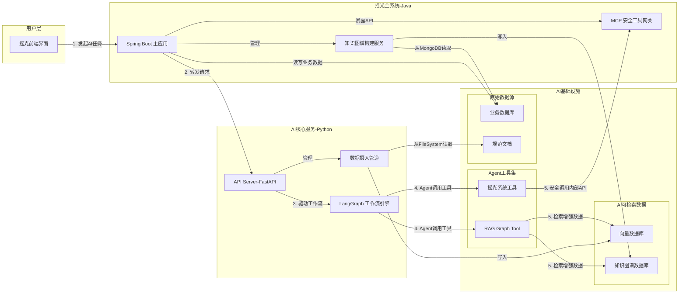
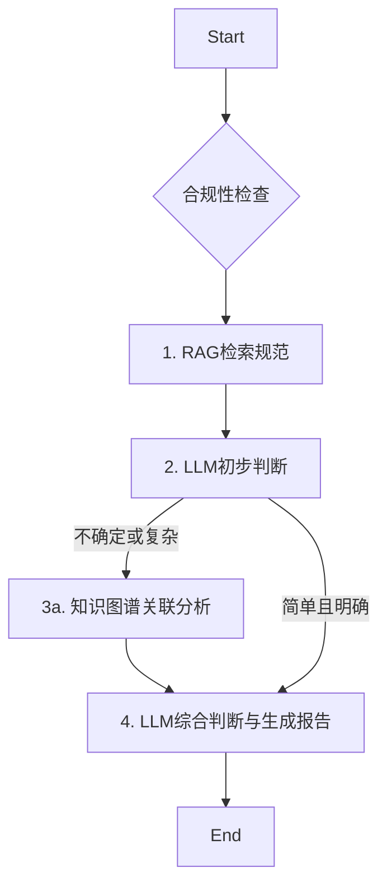
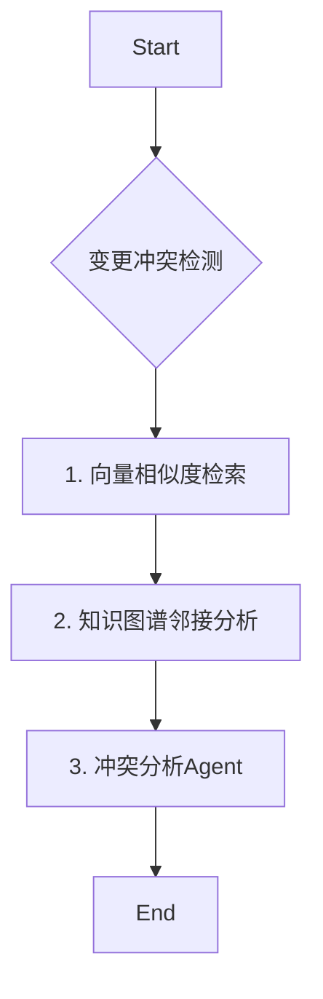

# AI-RME 融合架构设计

## 1. 概述

本文档目的在于为“摇光”需求管理工程（RME）系统设计一个全面、可扩展的AI融合架构（AI-RME）。架构深度集成大型语言模型（LLM）、知识图谱（Knowledge Graph）、检索增强生成（RAG）和多Agent协作技术，实现需求的智能化分析、验证和管理。

架构核心是**Agentic RAG**，它通过**LangGraph**工作流引擎进行驱动，利用**知识图谱**表达和推理需求间的复杂关系，并通过**模型-上下文协议（MCP）**与外部工具和主系统安全交互，最终赋能三大核心功能：**合规性检查**、**变更冲突检测**、和**需求工程语义理解**。

## 2. 整体架构

AI-RME采用面向未来的微服务架构，将AI能力与现有“摇光”系统解耦，确保系统的健壮性、可维护性和水平扩展能力。

### 2.1 架构图



### 2.2 架构说明

1.  **摇光主系统-Java**：
    *   **Spring Boot 主应用**: 业务逻辑核心，处理前端请求。
    *   **MCP 安全工具网关**: 向AI服务安全地暴露内部API。
    *   **知识图谱构建服务**: 后台服务，将MongoDB中的业务数据同步到Neo4j知识图谱中。

2.  **AI核心服务-Python**：
    *   **API Server-FastAPI**: 提供AI能力的API端点，是与主系统交互的入口。
    *   **数据摄入管道**: 后台进程，负责将原始规范文档处理并加载到向量数据库中，为RAG做准备。
    *   **LangGraph 工作流引擎**: 负责定义和执行由多个Agent组成的复杂AI工作流。

3.  **AI基础设施**：
    *   **Agent工具集**:
        *   **RAG Graph Tool**: 核心检索工具，能从向量数据库和知识图谱中检索信息。
        *   **MCP Tool**: AI Agent调用摇光主系统业务逻辑的唯一入口。
    *   **AI可检索数据**:
        *   **向量数据库 (Qdrant)**: 存储文本向量，用于语义搜索。
        *   **知识图谱数据库 (Neo4j)**: 存储实体和关系，用于逻辑推理。
    *   **原始数据源**:
        *   **业务数据库 (MongoDB)**: 业务数据的主存储。
        *   **规范文档 (File System)**: RAG数据摄入的源头。

## 3. 微服务模块职责划分

| 微服务名称 | 主要技术栈 | 核心职责 |
| :--- | :--- | :--- |
| **yg-system** | Java, Spring Boot | 1. 核心业务逻辑处理。<br>2. 提供前端API。<br>3. 实现MCP网关，暴露安全的内部工具。<br>4. 异步触发AI任务。<br>5. 实现知识图谱构建与同步逻辑。 |
| **ai-service** | Python, FastAPI, LangGraph | 1. 托管和执行所有AI Agent与工作流。<br>2. 实现Agent的反思、记忆、A2A协作机制。<br>3. 封装和管理所有供Agent使用的工具。<br>4. 提供AI能力的API端点。 |
| **mongodb** | MongoDB | 存储所有核心业务数据，如项目、需求、用户等。 |
| **qdrant** | Qdrant | 存储需求文本的向量嵌入，支持高效的语义相似度检索。 |
| **neo4j** | Neo4j | 存储需求知识图谱，支持复杂的关联关系查询和推理。 |

## 4. 数据流与工作流设计 (基于LangGraph)

LangGraph通过管理一个共享的**状态（State）**对象来编排工作流。每个Agent节点执行完毕后，会更新状态，然后由条件逻辑决定下一个要执行的节点。

### 4.1 核心状态 (State) 设计

```python
from typing import TypedDict, List, Dict
from langchain_core.documents import Document

class AIWorkFlowState(TypedDict):
    original_query: str      # 用户的原始请求
    current_task: str        # 当前正在执行的任务描述
    history: List[str]       # 对话或操作历史
    retrieved_docs: List[Document] # RAG检索出的文档
    kg_insights: Dict        # 知识图谱的洞察
    generation: str          # LLM生成的内容
    agent_scratchpad: str    # Agent的思考过程
    final_answer: str        # 最终答案
```

### 4.2 合规性检查工作流

**目标**：检查单条或多条需求是否符合指定的规范文档。



1.  **RAG检索规范 (RAG Node)**:
    *   **前提**: 规范文档已通过**数据摄入管道**被处理并加载到Qdrant向量数据库中。
    *   **输入**: 需求文本。
    *   **动作**: 调用`RAG_Tool`，在Qdrant中检索与需求文本最相关的规范条款块。
    *   **输出**: 更新`retrieved_docs`状态。
2.  **LLM初步判断 (Compliance Agent Node)**:
    *   **输入**: 需求文本、`retrieved_docs`。
    *   **动作**: LLM根据检索到的规范，对需求进行初步判断。
    *   **输出**: 生成初步结论，更新`generation`状态。
3.  **知识图谱关联分析 (KG Node)**:
    *   **条件**: 如果初步判断不确定（例如，需求涉及多个系统组件）。
    *   **动作**: 查询知识图谱（Neo4j），获取该需求关联的其他需求、依赖项、所属系统模块等信息。
    *   **输出**: 更新`kg_insights`状态。
4.  **LLM综合判断 (Report Agent Node)**:
    *   **输入**: `generation`、`kg_insights`。
    *   **动作**: LLM结合初步判断和知识图谱的上下文信息，生成最终的、详细的合规性报告，包括不合规项、理由和修改建议。
    *   **输出**: 更新`final_answer`状态。

### 4.3 变更冲突检测工作流

**目标**：当一个需求变更时，检测其与现有需求是否存在语义重复或逻辑矛盾。



1.  **向量相似度检索 (Vector Search Node)**:
    *   **输入**: 变更后的需求文本。
    *   **动作**: 在Qdrant中搜索语义最相似的Top-K个需求。
    *   **输出**: 更新`retrieved_docs`状态。
2.  **知识图谱邻接分析 (KG Node)**:
    *   **输入**: 变更需求ID、`retrieved_docs`中的需求ID。
    *   **动作**: 在Neo4j中查询这些需求的一度或二度邻接节点（如父子需求、依赖关系、实现的功能模块），以发现间接关联。
    *   **输出**: 更新`kg_insights`状态。
3.  **冲突分析Agent (Conflict Agent Node)**:
    *   **输入**: 变更需求、`retrieved_docs`、`kg_insights`。
    *   **动作**: LLM分析所有信息，判断是否存在冲突。
        *   **语义冲突**: “这个新需求和需求#123似乎在做同一件事。”
        *   **逻辑冲突**: “这个需求要求A模块独立，但它依赖的需求#456却要求A模块与B模块紧耦合。”
    *   **输出**: 生成冲突报告，更新`final_answer`状态。

## 5. 技术实现方案

### 5.1 Agentic RAG
传统的RAG是被动的，而Agentic RAG是主动的。Agent可以根据任务的复杂性，自主决定执行多步检索、融合多种数据源。
*   **实现**: `RAG Graph Tool`将封装一个查询路由器（Query Router）。当Agent调用该工具时，路由器首先分析查询意图，然后决定是执行向量搜索、知识图谱查询，还是两者都执行，最后将结果融合后返回。

### 5.2 知识图谱 (KG)
*   **构建**: `yg-system`中的`KG_Builder`服务将监听MongoDB的变更流（Change Streams）或定时轮询，将需求（节点）、关系（边）和其他元数据（属性）同步到Neo4j。
*   **查询**: Agent通过工具调用`ai-service`中的图谱查询接口，该接口使用Cypher查询语言与Neo4j交互。查询结果将转换为自然语言或JSON格式供LLM理解。

### 5.3 Agent能力设计
*   **A2A协作**: LangGraph天然支持多Agent协作。例如，在复杂任务中，`MasterAgent`可以先调用`ComplianceAgent`进行合规检查，再调用`ConflictAgent`进行冲突分析，最后自己汇总报告。
*   **反思机制 (Reflection)**: 在关键步骤后增加一个“反思”节点。该节点让LLM检查上一步的输出是否合理、是否满足任务要求。如果不满足，可以修正输出或回到上一步重新执行。
*   **记忆管理**:
    *   **短期记忆**: 在LangGraph的`State`对象中维护，随工作流传递，实现单次任务内的上下文记忆。
    *   **长期记忆**: 将重要的对话历史、用户偏好、关键决策结果等，通过`MCP_Tool`存回`yg-system`的数据库中，供未来的Agent调用。

### 5.4 防止Context无限增长
对于大规模需求处理（如1000条需求的合规性检测），一次性将所有信息塞给LLM是不可行的。
*   **分块处理**: `MasterAgent`首先从知识图谱中分析需求的关联性，将1000条需求分成多个高内聚、低耦合的**簇（Cluster）**。
*   **并行执行**: LangGraph可以为每个簇启动一个并行的子工作流进行处理。
*   **结果汇总**: 所有子工作流完成后，由一个`SummaryAgent`负责汇总和提炼结果。

## 6. 部署和扩展策略

*   **开发环境**: 使用`docker-compose`一键启动所有微服务，方便本地开发和调试。
*   **生产环境**:
    *   **容器化**: 所有微服务都将打包成Docker镜像。
    *   **编排**: 使用Kubernetes进行容器编排。
    *   **扩展性**:
        *   `ai-service`是计算密集型服务，可以根据API网关的请求量配置HPA（Horizontal Pod Autoscaler）进行水平扩展。
        *   `qdrant`和`neo4j`支持集群部署，以应对大规模数据和高并发查询。
    *   **CI/CD**: 建立自动化的CI/CD流水线，实现代码提交、测试、镜像构建和部署的自动化。
