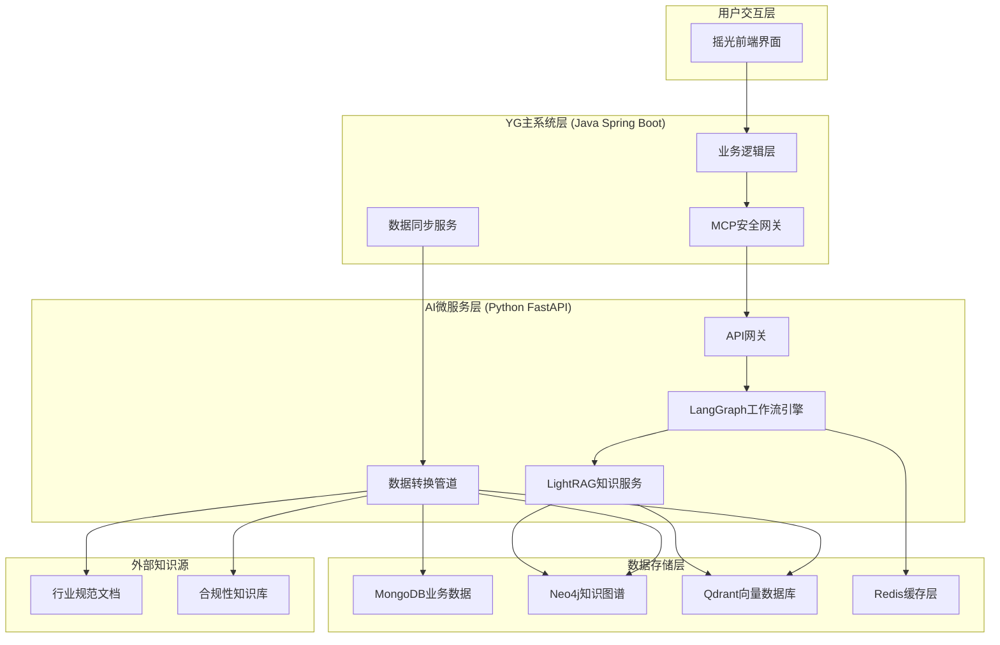

# AI-RME 集成 LightRAG 实施方案

## 1. 项目概述

### 1.1 集成目标

本方案旨在将 LightRAG 深度集成到摇光（YG）需求管理系统中，通过 LangGraph 驱动的 AI 微服务实现智能化需求工程能力。核心目标包括：

- **智能需求分析**：基于知识图谱的需求语义理解和关联分析
- **变更冲突检测**：实时检测需求变更的潜在冲突和影响范围
- **合规性检查**：集成行业知识库进行自动化合规性验证
- **追溯关系分析**：基于图谱的需求追溯和依赖关系分析
- **智能决策支持**：为需求工程提供数据驱动的决策建议

### 1.2 技术价值

- **零侵入集成**：通过微服务架构，不影响现有 YG 系统稳定性
- **实时数据同步**：基于 MongoDB Change Streams 的增量数据同步
- **多模态检索**：结合向量检索、图谱查询和语义搜索
- **可扩展架构**：支持水平扩展和功能模块化扩展

## 2. 技术架构设计

### 2.1 整体架构图



### 2.2 核心组件说明

#### 2.2.1 YG主系统层
- **业务逻辑层**：现有 Spring Boot 应用，处理核心业务逻辑
- **MCP安全网关**：基于 Model-Context Protocol 的安全 API 网关
- **数据同步服务**：监控 MongoDB 变更，触发 AI 服务同步

#### 2.2.2 AI微服务层
- **API网关**：FastAPI 服务，提供 RESTful API 接口
- **LangGraph工作流引擎**：多 Agent 协作的工作流编排
- **LightRAG知识服务**：知识图谱构建、查询和推理服务
- **数据转换管道**：MongoDB 数据到知识图谱的 ETL 处理

#### 2.2.3 数据存储层
- **MongoDB**：业务数据主存储（现有）
- **Neo4j**：知识图谱存储，支持复杂关系查询
- **Qdrant**：向量数据库，支持语义相似度检索
- **Redis**：缓存层，提升查询性能

## 3. 数据处理策略

### 3.1 YG实体到知识图谱映射

#### 3.1.1 核心实体映射表

| YG实体 | 知识图谱节点类型 | 属性映射 | 关系类型 |
|--------|-----------------|----------|----------|
| File | Project | name, description, author | CONTAINS |
| Requirement | Requirement | title, content, type, priority, status | DEPENDS_ON, TRACES_TO |
| Relationship | Edge | type, description | 动态关系类型 |
| Table | RequirementGroup | name, displayed | GROUPS |
| Dir | Folder | name, parentId | CONTAINS |
| Matrix | RelationshipMatrix | rowScope, columnScope | ANALYZES |

#### 3.1.2 实体转换示例

```python
class YGEntityTransformer:
    """YG实体到知识图谱转换器"""
    
    async def transform_requirement(self, req: Dict) -> Dict:
        """转换需求实体"""
        return {
            'entity_name': f"需求_{req['_id']}",
            'entity_type': 'Requirement',
            'description': f"标题: {req.get('title', '')}. "
                          f"内容: {req.get('content', '')}. "
                          f"类型: {req.get('type', '')}. "
                          f"优先级: {req.get('priority', '')}. "
                          f"状态: {req.get('status', '')}",
            'properties': {
                'id': str(req['_id']),
                'title': req.get('title', ''),
                'content': req.get('content', ''),
                'type': req.get('type', ''),
                'priority': req.get('priority', ''),
                'status': req.get('status', ''),
                'fileId': req.get('fileId', ''),
                'tableId': req.get('tableId', ''),
                'createTime': req.get('createTime', ''),
                'updateTime': req.get('updateTime', '')
            }
        }
    
    async def transform_relationship(self, rel: Dict) -> Dict:
        """转换关系实体"""
        return {
            'src_id': f"需求_{rel['sourceId']}",
            'tgt_id': f"需求_{rel['targetId']}",
            'description': f"需求 {rel['sourceId']} 与需求 {rel['targetId']} "
                          f"存在 {rel.get('type', 'related')} 关系",
            'keywords': f"{rel.get('type', 'related')},关联,依赖",
            'weight': self._calculate_relationship_weight(rel),
            'properties': {
                'type': rel.get('type', ''),
                'fileId': rel.get('fileId', ''),
                'createTime': rel.get('createTime', '')
            }
        }
```

### 3.2 增量数据同步机制

#### 3.2.1 MongoDB Change Streams 监控

```python
class YGDataSyncManager:
    """YG数据同步管理器"""
    
    async def setup_change_stream_monitoring(self):
        """设置变更流监控"""
        collections_to_monitor = [
            'requirements', 'relationship', 'file', 'table'
        ]
        
        for collection_name in collections_to_monitor:
            asyncio.create_task(
                self._monitor_collection_changes(collection_name)
            )
    
    async def _monitor_collection_changes(self, collection_name: str):
        """监控集合变更"""
        collection = self.db[collection_name]
        
        async with collection.watch() as stream:
            async for change in stream:
                await self._process_change_event(change, collection_name)
    
    async def _process_change_event(self, change: Dict, collection: str):
        """处理变更事件"""
        operation_type = change['operationType']
        
        if operation_type == 'insert':
            await self._handle_insert(change, collection)
        elif operation_type == 'update':
            await self._handle_update(change, collection)
        elif operation_type == 'delete':
            await self._handle_delete(change, collection)
```

## 4. 核心功能实现

### 4.1 智能需求分析

#### 4.1.1 LangGraph 工作流设计

```python
class RequirementAnalysisWorkflow:
    """需求分析工作流"""
    
    def build_workflow(self):
        """构建需求分析工作流"""
        workflow = StateGraph(RequirementAnalysisState)
        
        # 添加节点
        workflow.add_node("context_retrieval", self.retrieve_context)
        workflow.add_node("semantic_analysis", self.analyze_semantics)
        workflow.add_node("relationship_analysis", self.analyze_relationships)
        workflow.add_node("impact_assessment", self.assess_impact)
        workflow.add_node("recommendation_generation", self.generate_recommendations)
        
        # 构建流程
        workflow.set_entry_point("context_retrieval")
        workflow.add_edge("context_retrieval", "semantic_analysis")
        workflow.add_edge("semantic_analysis", "relationship_analysis")
        workflow.add_edge("relationship_analysis", "impact_assessment")
        workflow.add_edge("impact_assessment", "recommendation_generation")
        workflow.add_edge("recommendation_generation", END)
        
        return workflow.compile()
    
    async def retrieve_context(self, state: RequirementAnalysisState):
        """检索需求上下文"""
        query = state["query"]
        
        # 多模式检索
        local_context = await self.lightrag.aquery(
            query, param=QueryParam(mode="local")
        )
        global_context = await self.lightrag.aquery(
            query, param=QueryParam(mode="global")
        )
        hybrid_context = await self.lightrag.aquery(
            query, param=QueryParam(mode="hybrid")
        )
        
        return {
            **state,
            "context": {
                "local": local_context,
                "global": global_context,
                "hybrid": hybrid_context
            }
        }
```

### 4.2 变更冲突检测

#### 4.2.1 冲突检测算法

```python
class ChangeConflictDetector:
    """变更冲突检测器"""
    
    async def detect_conflicts(self, changed_requirement_id: str) -> Dict:
        """检测需求变更冲突"""
        
        # 1. 获取变更需求的详细信息
        changed_req = await self._get_requirement_details(changed_requirement_id)
        
        # 2. 向量相似度检索
        similar_reqs = await self._find_similar_requirements(changed_req)
        
        # 3. 图谱关系分析
        related_reqs = await self._analyze_graph_relationships(changed_requirement_id)
        
        # 4. 冲突分析
        conflicts = await self._analyze_conflicts(changed_req, similar_reqs, related_reqs)
        
        return {
            "changed_requirement": changed_req,
            "similar_requirements": similar_reqs,
            "related_requirements": related_reqs,
            "conflicts": conflicts,
            "risk_level": self._calculate_risk_level(conflicts)
        }
    
    async def _find_similar_requirements(self, requirement: Dict) -> List[Dict]:
        """查找相似需求"""
        query = f"查找与以下需求相似的需求：{requirement['title']} {requirement['content']}"
        
        result = await self.lightrag.aquery(
            query, param=QueryParam(mode="naive")
        )
        
        return self._parse_similar_requirements(result)
```

### 4.3 合规性检查

#### 4.3.1 合规性检查工作流

```python
class ComplianceCheckWorkflow:
    """合规性检查工作流"""
    
    async def check_compliance(self, requirements: List[str]) -> Dict:
        """执行合规性检查"""
        
        results = []
        
        for req_id in requirements:
            # 获取需求详情
            req_details = await self._get_requirement_details(req_id)
            
            # RAG检索相关规范
            relevant_standards = await self._retrieve_standards(req_details)
            
            # LLM合规性判断
            compliance_result = await self._assess_compliance(
                req_details, relevant_standards
            )
            
            results.append({
                "requirement_id": req_id,
                "compliance_status": compliance_result["status"],
                "violations": compliance_result["violations"],
                "recommendations": compliance_result["recommendations"]
            })
        
        return {
            "total_requirements": len(requirements),
            "compliant_count": sum(1 for r in results if r["compliance_status"] == "compliant"),
            "violation_count": sum(1 for r in results if r["compliance_status"] == "violation"),
            "results": results
        }
```

## 5. LangGraph 工作流集成

### 5.1 多Agent协作架构

```python
class AIRMEAgentSystem:
    """AI-RME多Agent系统"""
    
    def __init__(self):
        self.agents = {
            "requirement_analyst": RequirementAnalystAgent(),
            "conflict_detector": ConflictDetectorAgent(),
            "compliance_checker": ComplianceCheckerAgent(),
            "impact_assessor": ImpactAssessorAgent(),
            "recommendation_generator": RecommendationGeneratorAgent()
        }
    
    def build_master_workflow(self):
        """构建主工作流"""
        workflow = StateGraph(MasterWorkflowState)
        
        # 添加Agent节点
        for agent_name, agent in self.agents.items():
            workflow.add_node(agent_name, agent.execute)
        
        # 添加路由逻辑
        workflow.add_conditional_edges(
            "requirement_analyst",
            self._route_next_agent,
            {
                "conflict_detection": "conflict_detector",
                "compliance_check": "compliance_checker",
                "impact_assessment": "impact_assessor"
            }
        )
        
        return workflow.compile()
```

### 5.2 Agent间通信协议

```python
class AgentCommunicationProtocol:
    """Agent间通信协议"""
    
    @dataclass
    class AgentMessage:
        sender: str
        receiver: str
        message_type: str
        payload: Dict[str, Any]
        timestamp: datetime
        correlation_id: str
    
    async def send_message(self, message: AgentMessage):
        """发送Agent消息"""
        await self.message_queue.put(message)
    
    async def broadcast_message(self, sender: str, message_type: str, payload: Dict):
        """广播消息给所有Agent"""
        for agent_name in self.agents.keys():
            if agent_name != sender:
                message = AgentMessage(
                    sender=sender,
                    receiver=agent_name,
                    message_type=message_type,
                    payload=payload,
                    timestamp=datetime.utcnow(),
                    correlation_id=str(uuid.uuid4())
                )
                await self.send_message(message)
```

## 6. 实施计划

### 6.1 分阶段实施策略

#### 阶段一：基础设施搭建（4周）
- [ ] AI微服务基础架构搭建
- [ ] LightRAG核心服务集成
- [ ] MongoDB数据连接和基础ETL
- [ ] 基础API接口开发

#### 阶段二：核心功能开发（6周）
- [ ] 需求分析工作流实现
- [ ] 变更冲突检测功能
- [ ] 基础合规性检查
- [ ] 数据同步机制完善

#### 阶段三：高级功能集成（4周）
- [ ] 多Agent协作系统
- [ ] 高级合规性检查
- [ ] 性能优化和缓存
- [ ] 监控和日志系统

#### 阶段四：测试与部署（3周）
- [ ] 集成测试和性能测试
- [ ] 生产环境部署
- [ ] 用户培训和文档
- [ ] 上线和监控

### 6.2 技术风险评估

| 风险项 | 风险等级 | 影响 | 缓解措施 |
|--------|----------|------|----------|
| 数据同步延迟 | 中 | 影响实时性 | 优化Change Streams，增加缓存 |
| LLM API限制 | 高 | 影响服务可用性 | 多模型备份，本地模型部署 |
| 知识图谱性能 | 中 | 影响查询速度 | 图谱优化，分布式部署 |
| 系统集成复杂度 | 高 | 开发周期延长 | 分阶段实施，充分测试 |

## 7. 总结

本方案提供了一个完整的 LightRAG 与 YG 系统集成解决方案，通过微服务架构实现了零侵入的 AI 能力增强。核心优势包括：

1. **技术先进性**：结合 LightRAG 的图谱能力和 LangGraph 的工作流编排
2. **业务适配性**：深度适配 YG 系统的需求工程场景
3. **可扩展性**：支持功能模块化扩展和水平扩展
4. **稳定性**：通过微服务解耦，确保系统稳定性

该方案为 YG 系统提供了强大的 AI 驱动的需求工程能力，将显著提升需求管理的智能化水平。
