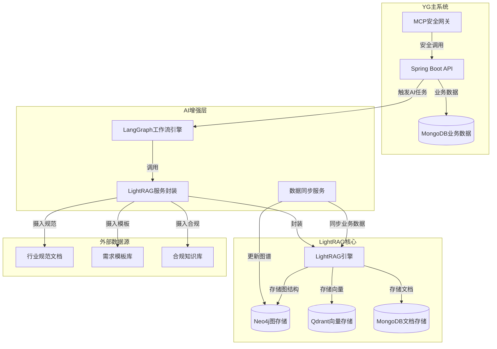
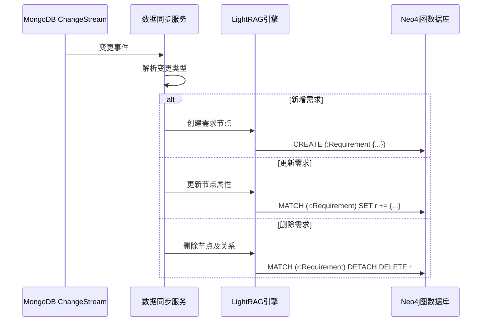

# AI-RME集成LightRAG完整技术方案

## 1. 项目背景与目标

### 1.1 项目背景
摇光(YG)需求管理系统是一个基于Spring Boot和MongoDB的企业级需求管理平台，具有复杂的项目-需求-关系数据模型。当前AI-RME架构设计已规划使用LangGraph作为AI工作流引擎，现需集成LightRAG作为核心RAG引擎，以提供更强大的图结构检索和知识管理能力。

### 1.2 集成目标
- **增强图检索能力**：利用LightRAG的图结构存储和检索能力，实现复杂需求关系的深度分析
- **统一知识管理**：将需求、规范文档、变更历史等统一纳入知识图谱管理
- **提升AI决策质量**：通过图结构上下文增强LLM的推理和判断能力
- **保持架构一致性**：与现有LangGraph工作流无缝集成

## 2. 技术架构设计

### 2.1 整体架构图



### 2.2 架构分层说明

#### 2.2.1 数据层
- **业务数据**：MongoDB存储原始需求、项目、关系等数据
- **图存储**：Neo4j存储需求关系图谱
- **向量存储**：Qdrant存储文本向量用于语义检索
- **文档存储**：MongoDB存储处理后的文档块

#### 2.2.2 服务层
- **LightRAG Core**：核心RAG引擎，提供图结构检索
- **数据同步服务**：业务数据到知识图谱的同步
- **文档摄入服务**：外部文档的解析和向量化

#### 2.2.3 应用层
- **LangGraph工作流**：编排AI任务流程
- **LightRAG服务封装**：为LangGraph提供统一接口
- **MCP网关**：安全访问主系统API

## 3. 数据模型映射

### 3.1 YG实体到LightRAG实体映射

| YG实体 | LightRAG实体类型 | 图节点属性 | 边关系 |
|--------|------------------|------------|--------|
| File(项目) | Project | id, name, description, author | CONTAINS |
| Requirement(需求) | Requirement | id, title, content, type, status | RELATED_TO, DEPENDS_ON, IMPLEMENTED_BY |
| Table(表格) | RequirementGroup | id, name, displayFields | GROUPS |
| Relationship(关系) | 边类型 | type, source, target | 直接映射 |
| FileTemplate(模板) | Template | id, name, type, description | DEFINES |

### 3.2 图结构定义

#### 3.2.1 节点类型
```python
class ProjectNode:
    id: str  # fileId
    name: str
    description: str
    author: str
    create_time: datetime
    update_time: datetime
    node_type: str = "PROJECT"

class RequirementNode:
    id: str  # requirementId
    title: str
    content: str
    type: str  # requirement type
    status: str  # lifecycle status
    priority: str
    create_time: datetime
    update_time: datetime
    node_type: str = "REQUIREMENT"

class TemplateNode:
    id: str  # templateId
    name: str
    type: str  # system/custom
    description: str
    node_type: str = "TEMPLATE"
```

#### 3.2.2 边类型
```python
class ContainsEdge:
    source: str  # Project ID
    target: str  # Requirement ID
    relationship_type: str = "CONTAINS"

class RelatedToEdge:
    source: str  # Requirement ID
    target: str  # Requirement ID
    relationship_type: str  # FROM YG Relationship.type
    strength: float  # 语义相似度

class DependsOnEdge:
    source: str  # Requirement ID
    target: str  # Requirement ID
    dependency_type: str  # functional/technical/business
```

## 4. 数据流设计

### 4.1 数据同步流程

#### 4.1.1 实时同步


#### 4.1.2 批量同步
```python
class YGDataSyncService:
    def __init__(self, mongodb_client, lightrag_instance):
        self.mongo = mongodb_client
        self.lightrag = lightrag_instance
    
    async def sync_project(self, file_id: str):
        """同步单个项目"""
        project = await self.mongo.files.find_one({"_id": file_id})
        requirements = await self.mongo.requirements.find({"fileId": file_id})
        relationships = await self.mongo.relationships.find({"fileId": file_id})
        
        # 构建图数据
        project_node = self._build_project_node(project)
        requirement_nodes = [self._build_requirement_node(r) for r in requirements]
        relationship_edges = [self._build_relationship_edge(r) for r in relationships]
        
        # 批量插入LightRAG
        await self.lightrag.insert_kg_batch(
            nodes=[project_node] + requirement_nodes,
            edges=relationship_edges
        )
```

### 4.2 文档摄入流程

#### 4.2.1 规范文档处理
```python
class DocumentIngestionService:
    def __init__(self, lightrag_instance):
        self.lightrag = lightrag_instance
    
    async def ingest_compliance_docs(self, file_paths: List[str]):
        """摄入合规规范文档"""
        for file_path in file_paths:
            # 1. 文档解析
            content = await self._parse_document(file_path)
            
            # 2. 文本分块
            chunks = self._chunk_text(content, chunk_size=1000, overlap=200)
            
            # 3. 向量化存储
            for chunk in chunks:
                await self.lightrag.ainsert(chunk)
    
    def _chunk_text(self, text: str, chunk_size: int, overlap: int) -> List[str]:
        """智能文本分块"""
        # 使用语义分块算法，保持上下文完整性
        pass
```

## 5. LangGraph集成设计

### 5.1 LightRAG工具封装

#### 5.1.1 工具接口定义
```python
from typing import List, Dict, Any
from langchain_core.tools import BaseTool
from pydantic import BaseModel, Field

class LightRAGSearchInput(BaseModel):
    query: str = Field(description="搜索查询")
    search_type: str = Field(default="hybrid", description="搜索类型: vector, graph, hybrid")
    top_k: int = Field(default=10, description="返回结果数量")
    filters: Dict[str, Any] = Field(default_factory=dict, description="过滤条件")

class LightRAGTool(BaseTool):
    name: str = "lightrag_search"
    description: str = "使用LightRAG进行需求和知识检索"
    args_schema: type[BaseModel] = LightRAGSearchInput
    
    def __init__(self, lightrag_instance):
        super().__init__()
        self.lightrag = lightrag_instance
    
    async def _arun(
        self, 
        query: str, 
        search_type: str = "hybrid", 
        top_k: int = 10,
        filters: Dict[str, Any] = {}
    ) -> List[Dict[str, Any]]:
        """异步执行LightRAG搜索"""
        
        if search_type == "vector":
            results = await self.lightrag.aquery(
                query, 
                param=QueryParam(mode="naive", top_k=top_k)
            )
        elif search_type == "graph":
            results = await self.lightrag.aquery(
                query,
                param=QueryParam(mode="local", top_k=top_k)
            )
        else:  # hybrid
            results = await self.lightrag.aquery(
                query,
                param=QueryParam(mode="hybrid", top_k=top_k)
            )
        
        return self._format_results(results)
```

#### 5.1.2 高级查询工具
```python
class GraphAnalysisTool(BaseTool):
    name: str = "graph_analysis"
    description: str = "分析需求关系图谱"
    
    async def _arun(
        self,
        requirement_id: str,
        analysis_type: str = "neighborhood",
        depth: int = 2
    ) -> Dict[str, Any]:
        """分析需求在图中的关系"""
        
        if analysis_type == "neighborhood":
            # 获取邻域分析
            return await self._get_neighborhood_analysis(requirement_id, depth)
        elif analysis_type == "impact":
            # 影响分析
            return await self._get_impact_analysis(requirement_id)
        elif analysis_type == "similarity":
            # 相似需求分析
            return await self._get_similar_requirements(requirement_id)
```

### 5.2 LangGraph工作流节点

#### 5.2.1 合规检查工作流
```python
from typing import TypedDict, List
from langgraph.graph import StateGraph

class ComplianceState(TypedDict):
    requirement_text: str
    requirement_id: str
    project_id: str
    compliance_results: List[Dict]
    final_report: str

def create_compliance_workflow(lightrag_tools):
    workflow = StateGraph(ComplianceState)
    
    # 节点定义
    workflow.add_node("retrieve_standards", retrieve_standards_node)
    workflow.add_node("check_compliance", check_compliance_node)
    workflow.add_node("graph_analysis", graph_analysis_node)
    workflow.add_node("generate_report", generate_report_node)
    
    # 边定义
    workflow.set_entry_point("retrieve_standards")
    workflow.add_edge("retrieve_standards", "check_compliance")
    workflow.add_edge("check_compliance", "graph_analysis")
    workflow.add_edge("graph_analysis", "generate_report")
    workflow.set_finish_point("generate_report")
    
    return workflow

async def retrieve_standards_node(state: ComplianceState) -> ComplianceState:
    """检索相关规范"""
    lightrag_search = LightRAGTool(lightrag_instance)
    standards = await lightrag_search._arun(
        query=state["requirement_text"],
        search_type="hybrid",
        filters={"type": "compliance_doc"}
    )
    return {**state, "standards": standards}
```

#### 5.2.2 变更影响分析工作流
```python
class ChangeImpactState(TypedDict):
    changed_requirement: Dict
    original_text: str
    new_text: str
    affected_requirements: List[Dict]
    conflict_analysis: Dict
    recommendations: List[str]

def create_change_impact_workflow(lightrag_tools):
    workflow = StateGraph(ChangeImpactState)
    
    workflow.add_node("find_affected", find_affected_requirements_node)
    workflow.add_node("analyze_conflicts", analyze_conflicts_node)
    workflow.add_node("generate_recommendations", generate_recommendations_node)
    
    workflow.set_entry_point("find_affected")
    workflow.add_edge("find_affected", "analyze_conflicts")
    workflow.add_edge("analyze_conflicts", "generate_recommendations")
    workflow.set_finish_point("generate_recommendations")
    
    return workflow
```

## 6. 关键集成点实现

### 6.1 LightRAG配置优化

#### 6.1.1 存储配置
```python
from lightrag import LightRAG, QueryParam
from lightrag.llm import openai_complete_if_cache, openai_embedder
from lightrag.kg import neo4j_impl, qdrant_impl, mongo_impl

class YGLightRAGConfig:
    def __init__(self):
        self.working_dir = "./yg_lightrag_storage"
        
        # 存储配置
        self.kv_storage = "MongoKVStorage"
        self.vector_storage = "QdrantVectorStorage"
        self.graph_storage = "Neo4jStorage"
        self.doc_status_storage = "MongoDocStatusStorage"
        
        # LLM配置
        self.llm_model_func = openai_complete_if_cache
        self.embedding_func = openai_embedder
        
        # 存储连接配置
        self.neo4j_config = {
            "uri": "bolt://localhost:7687",
            "username": "neo4j",
            "password": "password"
        }
        
        self.qdrant_config = {
            "host": "localhost",
            "port": 6333,
            "collection_name": "yg_requirements"
        }
        
        self.mongo_config = {
            "connection_string": "mongodb://localhost:27017/",
            "database_name": "yg_lightrag"
        }

async def initialize_yg_lightrag(config: YGLightRAGConfig) -> LightRAG:
    """初始化YG专用的LightRAG实例"""
    rag = LightRAG(
        working_dir=config.working_dir,
        kv_storage=config.kv_storage,
        vector_storage=config.vector_storage,
        graph_storage=config.graph_storage,
        doc_status_storage=config.doc_status_storage,
        llm_model_func=config.llm_model_func,
        embedding_func=config.embedding_func
    )
    
    # 初始化存储
    await rag.initialize_storages()
    
    return rag
```

### 6.2 数据转换适配器

#### 6.2.1 YG实体转换器
```python
class YGEntityAdapter:
    """YG实体到LightRAG实体的转换器"""
    
    @staticmethod
    def requirement_to_text(requirement: Dict) -> str:
        """将需求转换为文本表示"""
        title = requirement.get('需求名称', '') or requirement.get('title', '')
        content = requirement.get('需求描述', '') or requirement.get('content', '')
        
        # 构建结构化文本
        text_parts = [
            f"需求标题: {title}",
            f"需求描述: {content}"
        ]
        
        # 添加其他重要字段
        important_fields = ['优先级', '状态', '负责人', '截止日期']
        for field in important_fields:
            if field in requirement and requirement[field]:
                text_parts.append(f"{field}: {requirement[field]}")
        
        return "\n".join(text_parts)
    
    @staticmethod
    def project_to_metadata(file_data: Dict) -> Dict:
        """将项目数据转换为元数据"""
        return {
            "project_id": file_data["_id"],
            "project_name": file_data["name"],
            "author": file_data.get("author", ""),
            "create_time": file_data["createTime"].isoformat(),
            "type": "project"
        }
```

### 6.3 API接口设计

#### 6.3.1 FastAPI服务接口
```python
from fastapi import FastAPI, HTTPException
from pydantic import BaseModel
import asyncio

app = FastAPI(title="YG-LightRAG集成服务")

class RequirementQuery(BaseModel):
    requirement_id: str
    query_type: str  # "compliance", "impact", "similarity"
    context: Dict[str, Any] = {}

class BatchQuery(BaseModel):
    project_id: str
    query_text: str
    filters: Dict[str, Any] = {}

@app.post("/api/requirement/analyze")
async def analyze_requirement(query: RequirementQuery):
    """分析单个需求"""
    try:
        # 获取需求数据
        requirement = await get_requirement_from_mongodb(query.requirement_id)
        
        # 执行LightRAG分析
        result = await execute_lightrag_analysis(requirement, query.query_type)
        
        return {"status": "success", "data": result}
    except Exception as e:
        raise HTTPException(status_code=500, detail=str(e))

@app.post("/api/project/search")
async def search_project_requirements(query: BatchQuery):
    """在项目内搜索相关需求"""
    try:
        # 构建搜索上下文
        context = {
            "project_id": query.project_id,
            **query.filters
        }
        
        # 执行LightRAG搜索
        results = await lightrag_service.search(
            query=query.query_text,
            context=context
        )
        
        return {"status": "success", "results": results}
    except Exception as e:
        raise HTTPException(status_code=500, detail=str(e))

@app.post("/api/sync/project/{project_id}")
async def sync_project_data(project_id: str):
    """同步项目数据到LightRAG"""
    try:
        sync_service = YGDataSyncService(mongodb_client, lightrag_instance)
        await sync_service.sync_project(project_id)
        return {"status": "success", "message": f"Project {project_id} synced"}
    except Exception as e:
        raise HTTPException(status_code=500, detail=str(e))
```

## 7. 部署与运维

### 7.1 Docker部署配置

#### 7.1.1 Docker Compose配置
```yaml
version: '3.8'
services:
  yg-lightrag:
    build: .
    container_name: yg-lightrag-service
    ports:
      - "8000:8000"
    environment:
      - MONGODB_URI=mongodb://mongodb:27017/yg
      - NEO4J_URI=bolt://neo4j:7687
      - NEO4J_USER=neo4j
      - NEO4J_PASSWORD=password
      - QDRANT_HOST=qdrant
      - QDRANT_PORT=6333
      - OPENAI_API_KEY=${OPENAI_API_KEY}
    depends_on:
      - mongodb
      - neo4j
      - qdrant
    volumes:
      - ./storage:/app/storage
      - ./logs:/app/logs

  mongodb:
    image: mongo:5
    container_name: yg-mongodb
    ports:
      - "27017:27017"
    volumes:
      - mongodb_data:/data/db
    environment:
      - MONGO_INITDB_ROOT_USERNAME=admin
      - MONGO_INITDB_ROOT_PASSWORD=password

  neo4j:
    image: neo4j:5
    container_name: yg-neo4j
    ports:
      - "7474:7474"
      - "7687:7687"
    environment:
      - NEO4J_AUTH=neo4j/password
      - NEO4J_PLUGINS=["apoc"]
    volumes:
      - neo4j_data:/data

  qdrant:
    image: qdrant/qdrant:latest
    container_name: yg-qdrant
    ports:
      - "6333:6333"
    volumes:
      - qdrant_data:/qdrant/storage

volumes:
  mongodb_data:
  neo4j_data:
  qdrant_data:
```

### 7.2 监控与日志

#### 7.2.1 性能监控
```python
import logging
import time
from functools import wraps

logger = logging.getLogger(__name__)

def monitor_performance(func):
    """性能监控装饰器"""
    @wraps(func)
    async def wrapper(*args, **kwargs):
        start_time = time.time()
        try:
            result = await func(*args, **kwargs)
            execution_time = time.time() - start_time
            
            logger.info(
                f"Function {func.__name__} executed in {execution_time:.2f}s"
            )
            
            # 记录到监控系统
            await record_metric(
                metric_name=f"{func.__name__}_execution_time",
                value=execution_time
            )
            
            return result
        except Exception as e:
            logger.error(f"Function {func.__name__} failed: {str(e)}")
            raise
    return wrapper
```

## 8. 测试策略

### 8.1 单元测试
```python
import pytest
from unittest.mock import AsyncMock, patch

class TestYGLightRAGIntegration:
    
    @pytest.mark.asyncio
    async def test_requirement_sync(self):
        """测试需求数据同步"""
        mock_mongo = AsyncMock()
        mock_lightrag = AsyncMock()
        
        service = YGDataSyncService(mock_mongo, mock_lightrag)
        
        # 测试数据
        requirement = {
            "_id": "req123",
            "需求名称": "用户登录功能",
            "需求描述": "实现用户通过邮箱和密码登录",
            "fileId": "file456"
        }
        
        mock_mongo.requirements.find_one.return_value = requirement
        
        result = await service.sync_requirement("req123")
        
        assert result is True
        mock_lightrag.ainsert.assert_called_once()
    
    @pytest.mark.asyncio
    async def test_compliance_check_workflow(self):
        """测试合规检查工作流"""
        workflow = create_compliance_workflow(lightrag_tools)
        
        initial_state = {
            "requirement_text": "用户密码必须至少8位",
            "requirement_id": "req123",
            "project_id": "file456"
        }
        
        result = await workflow.ainvoke(initial_state)
        
        assert "final_report" in result
        assert result["final_report"] is not None
```

### 8.2 集成测试
```python
@pytest.mark.integration
class TestLightRAGIntegration:
    
    async def test_end_to_end_requirement_analysis(self):
        """端到端需求分析测试"""
        # 1. 准备测试数据
        project_id = await self.create_test_project()
        requirement_id = await self.create_test_requirement(project_id)
        
        # 2. 同步数据
        await self.sync_service.sync_project(project_id)
        
        # 3. 执行分析
        result = await self.client.post(
            "/api/requirement/analyze",
            json={
                "requirement_id": requirement_id,
                "query_type": "compliance"
            }
        )
        
        assert result.status_code == 200
        assert result.json()["status"] == "success"
```

## 9. 性能优化

### 9.1 查询优化
- **索引优化**：为Neo4j图查询创建复合索引
- **缓存策略**：实现多级缓存减少重复查询
- **批量处理**：支持批量数据操作减少网络开销

### 9.2 并发处理
```python
import asyncio
from concurrent.futures import ThreadPoolExecutor

class ConcurrentLightRAGService:
    def __init__(self, lightrag_instance, max_workers=4):
        self.lightrag = lightrag_instance
        self.executor = ThreadPoolExecutor(max_workers=max_workers)
    
    async def batch_analyze_requirements(self, requirement_ids: List[str]):
        """批量分析需求"""
        tasks = [
            self.analyze_single_requirement(req_id)
            for req_id in requirement_ids
        ]
        
        results = await asyncio.gather(*tasks, return_exceptions=True)
        return results
```

## 10. 扩展与维护

### 10.1 插件机制
```python
class YGPluginManager:
    """YG系统插件管理器"""
    
    def __init__(self):
        self.plugins = {}
    
    def register_plugin(self, name: str, plugin_class):
        """注册新插件"""
        self.plugins[name] = plugin_class
    
    async def execute_plugin(self, name: str, context: Dict):
        """执行插件"""
        if name not in self.plugins:
            raise ValueError(f"Plugin {name} not found")
        
        plugin = self.plugins[name](context)
        return await plugin.execute()

class CustomAnalysisPlugin:
    """自定义分析插件示例"""
    def __init__(self, context):
        self.context = context
    
    async def execute(self):
        # 自定义分析逻辑
        pass
```

### 10.2 版本管理
- **数据迁移**：提供数据版本升级脚本
- **API版本**：支持API版本控制
- **向后兼容**：确保新版本不影响现有功能

## 11. 实施路线图

### 11.1 第一阶段：基础集成（2-3周）
- [ ] LightRAG服务部署和配置
- [ ] 基本数据同步功能实现
- [ ] 简单查询API开发

### 11.2 第二阶段：工作流集成（3-4周）
- [ ] LangGraph工作流节点开发
- [ ] 合规检查工作流实现
- [ ] 变更影响分析工作流实现

### 11.3 第三阶段：高级功能（2-3周）
- [ ] 批量处理优化
- [ ] 性能监控和调优
- [ ] 高级查询功能实现

### 11.4 第四阶段：生产部署（1-2周）
- [ ] 容器化部署
- [ ] 监控告警配置
- [ ] 文档和培训

## 12. 风险评估与应对

| 风险点 | 影响 | 应对措施 |
|--------|------|----------|
| 数据同步延迟 | 高 | 实现增量同步+批量补偿机制 |
| 大文档处理性能 | 中 | 实现异步处理队列+缓存机制 |
| 图查询复杂度 | 中 | 优化图结构+限制查询深度 |
| 版本兼容性 | 低 | 提供版本迁移工具+测试覆盖 |

## 13. 总结

本技术方案提供了YG系统与LightRAG的完整集成路径，通过图结构增强的需求分析和AI工作流，能够显著提升需求管理的智能化水平。方案采用渐进式实施策略，确保系统稳定性和功能完整性，同时为未来扩展预留了充足空间。

通过LightRAG的图结构存储和检索能力，YG系统将具备：
- 更精准的需求关系分析
- 更高效的合规性检查
- 更智能的变更影响评估
- 更强大的知识管理能力

这将为YG系统带来显著的竞争优势，满足企业级需求管理的复杂场景需求。