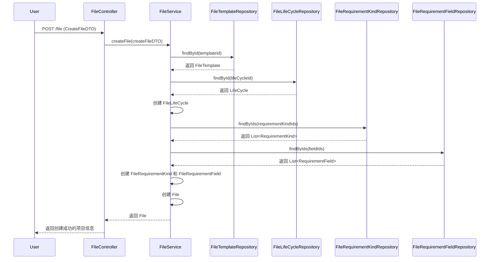
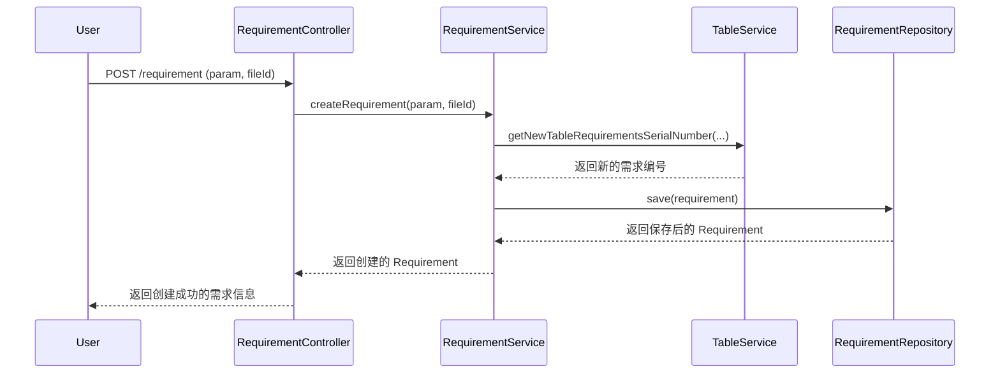

# ygCloud 架构分析

## 1. 功能概述

ygCloud 是一个需求管理系统，核心功能是围绕**项目（File）**、**需求（Requirement）** 和 **表格（Table）** 进行的。

*   **项目管理**: 用户可以创建、更新、删除、收藏和导入/导出项目。每个项目可以关联一个模板，模板中定义了需求的类型、字段和生命周期。
*   **需求管理**: 需求是项目的核心内容。用户可以创建、更新和删除需求。需求具有动态的字段，这些字段由项目关联的模板定义。需求之间可以建立关系，例如“跟踪”、“满足”等。
*   **表格视图**: 需求以表格的形式展示。用户可以自定义表格显示的列、顺序，并可以对表格进行排序和导出。
*   **可视化分析**: 系统支持通过分析图（AnalysisDiagram）和追溯图（TraceDiagram）对需求关系进行可视化展示。
*   **日志与审计**: 系统记录操作日志（OperationLog）和提交日志（CommitLog），用于追溯变更历史。

## 2. 架构分析

ygCloud 采用**单体应用**架构，基于 **Spring Boot** 框架开发。

*   **表现层 (Controller)**: `src/main/java/org/mda/yg/controller` 目录下的类负责处理 HTTP 请求，调用 Service 层处理业务逻辑，并返回 JSON 格式的数据给前端。
*   **业务逻辑层 (Service)**: `src/main/java/org/mda/yg/service` 目录下的接口和实现类是系统的核心，封装了所有的业务逻辑。
*   **数据访问层 (Repository)**: `src/main/java/org/mda/yg/repository` 目录下的接口负责与数据库进行交互。项目使用 **Spring Data MongoDB**，通过 `MongoRepository` 实现对 MongoDB 数据库的增删改查操作。
*   **数据模型 (Entity)**: `src/main/java/org/mda/yg/model/entity` 目录下的类定义了数据库中的集合（Collection）的结构。
*   **配置 (Config)**: `src/main/java/org/mda/yg/config` 目录下的类负责应用的配置，例如数据库连接、安全配置、跨域配置等。
*   **通用模块 (Common)**: `src/main/java/org/mda/yg/common` 目录下包含了一些通用的工具类、枚举、自定义异常和统一的结果返回模型。

## 3. 核心流程分析 (Flow)

### 3.1 创建一个带模板的项目

### 3.2 在表格中创建一个需求

